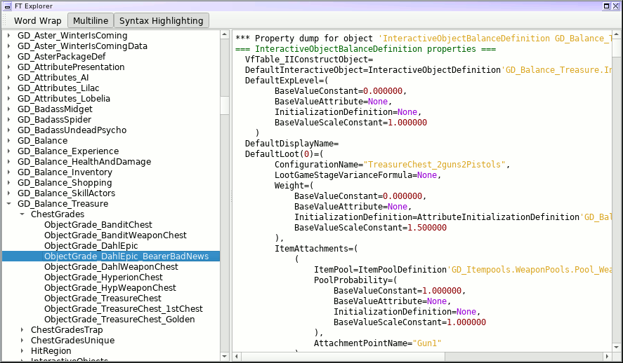

FilterTool Explorer (ft-explorer)
=================================

This is a little Python 3 / PyQt5 application to enable browsing of the
resource data used by the excellent Borderlands 2/TPS modding tool
[FilterTool](https://github.com/BLCM/BLCMods/wiki/UCP-Filter-Tool).

I threw this together because I like the way
[UE Explorer](http://eliotvu.com/portfolio/view/21/ue-explorer) lets you
browse around Borderlands objects/classes in a nice tree format, but using
UE Explorer is often a bit cumbersome: it doesn't work fantastically under
Wine *(I'm running Linux)*, it'll often require tweaks to its settings to
properly display some properties, and you've got to know or guess which UPK
file you need to look in to find what you're looking for.

Similarly, FilterTool is great for searching around and viewing Borderlands
data, because it contains an awful lot of pre-dumped class/object data
*(258MB uncompressed, in fact)*, but even though it's got an
autocomplete-like function, I often find myself missing the GUI browsing
which UE Explorer provides.

So, enter this app!  It takes the FilterTool pre-dumped data and presents
it in a tree, like UE Explorer would do.

Requirements
------------

This is a Python 3 + PyQt5 application.  It's been developed entirely on
Linux, but it works just fine in Windows (and should in Mac as well) so long as
you've got the necessary stuff installed, though Linux folks will have the
easiest time of it.

**Linux:** You may already have these installed via your package manager,
but if not, just use your package manger to install a package named something
like `python-pyqt5` or `pyqt5` or the like, and that should take care of it
for you.

**Windows/Mac:**
1. Install the latest Python 3.x.x version from
  [python.org](https://www.python.org/downloads/).  The latest (as of March 17,
  2018) is 3.6.4.
2. Be sure to check the option that says something like "Add Python.exe to path"
  or "Add Python to environment variables" when installing.
3. Hop out to a commandline/terminal/powershell and see if running the command
  `python -V` outputs something like `Python 3.6.4`.
4. If so, try just running `pip install PyQt5` or `pip3 install PyQt5`.  If that
  seemed to work, you may be good to go at that point!
5. Just double-click on `ft-explorer.py` in an Explorer/Finder window, to launch
  it.

Usage
-----

Simply run `ft-explorer.py` and it should do its thing.  If that's not
working, try running it from a commandline/terminal/console, to see if it's
printing out any error messages.

The data from UCP FilterTool 2.2 is bundled with the application, thanks to
LightChaosman.  There is no need to copy anything over from FilterTool.

You can add data to the resource library if you want, in the
`resources/BL2/dumps` and `resources/TPS/dumps` directories.  The files must
have the extensions `.dump.xz` or `.txt.xz` *([lzma/lzma2
compression](https://en.wikipedia.org/wiki/Xz))*.  Additionally, the utility
`generate_indexes.py` must be run whenever the data files are changed, to
update the indexes that the app uses to avoid having to load all the data
into memory at once.  Note that index generation takes quite awhile, since
I've not bothered to try optimizing it.

Status
------

This is a pretty quick-and-dirty app, and is unlikely to see much in the
way of feature improvements, or concessions to platforms other than Linux,
mostly because I assume I'm probably the only person who'll ever use it.
If there's Actual Interest from other folks, I'm guessing I could be
convinced to spend some more effort on it.

Some things which are at least somewhat likely to happen:

* Nothin'!  This app is currently feature-complete from my initial goals.
* Update to BLCMM data, once BLCMM is released.

Some things which are less likely to happen:

* Proper packaging *(for any platform)*
* Fancy icons and stuff in the tree
* While I have no intention of adding searching to the app, it *would*
  be useful to at least be able to `Ctrl-F` while looking at an object and
  be able to search within the displayed text.  I suspect that may be
  more work than I'm willing to put in, but it's a tempting thought...

Some things which are absolutely not going to happen:

* Searching *(FilterTool already does a great job at this)*

Credits
-------

The bundled pre-dumped object data is taken from UCP FilterTool, by
[LightChaosman](https://www.youtube.com/channel/UCgJ6TA5sZ_Rwc1LPDYbQT1Q), and
is included with their gracious consent.

License
-------

This is licensed under the [3-clause BSD license](https://opensource.org/licenses/BSD-3-Clause).
See [COPYING.txt](COPYING.txt).

The "Dark Theme" is Michell Stuttgart Faria's
[QDarkGray Stylesheet](https://github.com/mstuttgart/qdarkgray-stylesheet)
with a few custom modifications.  QDarkGray Stylesheet is itself a rework of
Colin Duquesnoy's [QDarkStyleSheet](https://github.com/ColinDuquesnoy/QDarkStyleSheet).
It is available under the [MIT License](qdarkgraystyle/COPYING.txt).

Redistribution of the bundled data in the `resources` directory should be
cleared with LightChaosman first.  Try the
[Shadow's Evil Hideout discord channel](https://discord.gg/0YjZxbVBS9b3bXUS).
